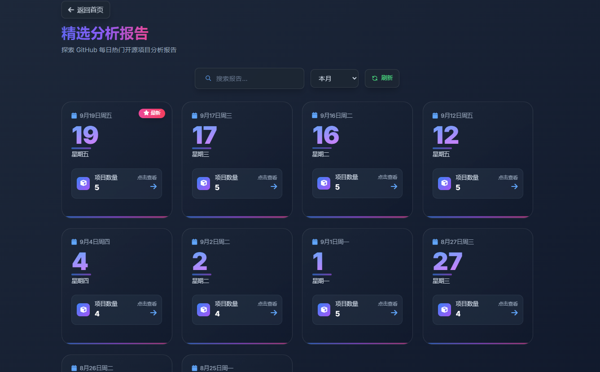

# GitHub Trending Reporter 🚀

English | [简体中文](./README.md)

**An automated bot that analyzes GitHub Trending, curates daily selections, and generates tech insight reports for you.**

[](https://opensource.org/licenses/MIT)
[](https://www.python.org/)
[](https://flask.palletsprojects.com/)
[](https://vuejs.org/)
[](https://www.docker.com/)

---

## ✨ Features

- **📈 Daily Tracking & Analysis**: Automatically fetches the latest trending projects from GitHub and performs in-depth analysis using Large Language Models (LLM), generating "one-sentence reviews," "technical highlights," and "potential impact" insights.
- **🌐 Interactive Web Interface**: Modern Vue.js-based frontend with beautiful report browsing, search, and filtering capabilities, supporting responsive design.
- **🚀 Multi-dimensional Data Analysis**: Built-in trend analysis dashboard featuring "most frequent trending projects," "popular programming languages distribution," "fastest growing star projects," and "tech domain analysis."
- **⚙️ Highly Configurable**: Almost all core parameters (LLM model, API endpoints, scraping frequency, report quantity, etc.) can be easily configured via environment variables.
- **📦 Out-of-the-box Deployment**: Docker support for one-click deployment without complex environment configuration, supporting multiple running modes (full service, web-only, reporter-only).
- **💾 Data Persistence**: Uses SQLite database to store historical data, avoiding duplicate analysis and supporting trend analysis features.

## 📝 Output Example

The project generates daily reports in the `output` directory.

### Markdown Report (`.md`)

A clean, structured Markdown file suitable for direct publishing on various platforms.

```markdown
## 🚀 The AI wave continues to sweep, and today GitHub is buzzing with several game-changing open-source models!

### ✨ awesome-project

**One-Sentence Review**: A revolutionary tool that solves a major pain point in the X domain.
**💡 Tech Highlights & Innovations**: It utilizes the latest A technology and B framework, with a particularly clever C design pattern.
**📈 Potential Impact & Applications**: Poised to set a new standard in the Y industry, especially suitable for X, Y, and Z scenarios.
**🔗 Project Link**: [awesome-project](https://github.com/user/awesome-project)

---

### ✨ another-cool-repo

**One-Sentence Review**: ...
...
```
 

### Interactive Web UI

An HTML file with a modern, card-based design for a better visual reading experience.



## 🛠️ Tech Stack

- **Backend**: Python 3.x, Flask
- **Frontend**: Vue.js, TypeScript
- **Data Scraping**: `requests`, `BeautifulSoup4`
- **AI Integration**: `openai`
- **Task Scheduling**: `schedule`
- **Database**: `SQLite`
- **Deployment**: `Docker`

## 📁 Project Structure

The project adopts a frontend-backend separation architecture:

```
├── backend/           # Backend code directory
│   ├── app/           # Core functionality modules
│   │   ├── analyzer.py      # Data analysis functionality
│   │   ├── summarizer.py    # AI summary generation
│   │   ├── scraper.py       # GitHub data scraping
│   │   ├── database.py      # Database operations
│   │   └── main.py          # Task execution entry point
│   ├── app.py         # Main program entry
│   └── router.py      # API route definitions
├── frontend/          # Frontend code directory
│   ├── src/           # Vue.js source code
│   │   ├── components/      # Reusable components
│   │   ├── views/           # Page views
│   │   └── api/             # API call encapsulation
│   └── package.json   # Frontend dependency configuration
├── .env.example       # Environment variables example file
└── README.md          # Project documentation
```

## 🚀 Installation and Setup

1.  **Clone the repository**
    ```bash
    git clone https://github.com/xiaoyeshiyu/ai-git-trending.git
    cd ai-git-trending
    ```

2.  **Install backend dependencies**
    It's recommended to install in a virtual environment:
    ```bash
    cd backend
    pip install -r requirements.txt
    ```

3.  **Configure environment variables**
    The project uses a `.env` file to manage sensitive information. Copy `.env.example` to `.env`:
    ```bash
    cp .env.example .env
    ```
    Then, edit the `.env` file to add your `LLM_API_KEY` and `LLM_BASE_URL`.
    ```env
    # .env
    LLM_API_KEY="sk-your_api_key_here"
    LLM_BASE_URL="https://api.openai.com/v1" # Change to your service's URL if using another provider
    LLM_MODEL="gpt-4-turbo" # Optional, defaults to gpt-4-turbo
    ```

## 🏃‍♂️ How to Run

### Method 1: Using Docker (Recommended)

Ensure you have Docker installed, then execute:
```bash
# Build the image
docker build -t trending-reporter .

# Run the container
docker run --env-file .env -p 5001:5001 trending-reporter
```

### Method 2: Running Locally

Start the backend service (unified entry point):
```bash
# Run full service (Web API + scheduled tasks) - Recommended
cd backend
python app.py

# Run only Web API service (for frontend development)
python app.py --mode web --debug

# Run only scheduled report generator
python app.py --mode reporter

# Custom host and port
python app.py --host 0.0.0.0 --port 8080 --debug
```

Install and start the frontend service (if you need the web interface):
```bash
cd frontend
npm install
npm run dev
```

Access URLs:
- **Backend API**: `http://127.0.0.1:5001`
- **Frontend Interface**: `http://127.0.0.1:5173`

## ⚙️ Configuration

### Environment Variables (`.env`)

- `LLM_API_KEY`: **(Required)** Your Large Language Model service API Key.
- `LLM_BASE_URL`: **(Required)** The base URL for your Large Language Model service.
- `LLM_MODEL`: (Optional) The model to use, defaults to `gpt-4-turbo`.
- `GITHUB_API_TOKEN`: (Optional) Your GitHub API Token. With this configured, you can get more detailed project information and avoid issues caused by API rate limits.
- `SCHEDULE_TIME`: (Optional) The time for the daily task to run, in "HH:MM" format. Defaults to `"09:00"`.
- `NUM_PROJECTS_TO_SUMMARIZE`: (Optional) The number of new projects to analyze each day. Defaults to `8`.
- `MAX_PROJECTS_TO_SCRAPE`: (Optional) The range of projects to filter from the Trending list. Defaults to `25`.
- `TRENDING_DATE_RANGE`: (Optional) The time range to scrape. Options are `daily`, `weekly`, `monthly`. Defaults to `daily`.

### Running Mode Parameters

The project supports three running modes, specified via the `--mode` parameter:

- `full`: Run the full service (Web API + scheduled tasks) [Default]
- `web`: Run only the Web API service (suitable for frontend development)
- `reporter`: Run only the scheduled report generator (suitable for background running)

Other common parameters:
- `--host`: Web service listening address, defaults to `127.0.0.1`
- `--port`: Web service port, defaults to `5001`
- `--debug`: Enable debug mode, suitable for development environment

## 🤝 Contributing

Contributions of any kind are welcome! If you have a great idea or find a bug, feel free to open an Issue or submit a Pull Request.

1.  Fork the Project
2.  Create your Feature Branch (`git checkout -b feature/AmazingFeature`)
3.  Commit your Changes (`git commit -m 'Add some AmazingFeature'`)
4.  Push to the Branch (`git push origin feature/AmazingFeature`)
5.  Open a Pull Request

## 📄 License

This project is licensed under the MIT License.
