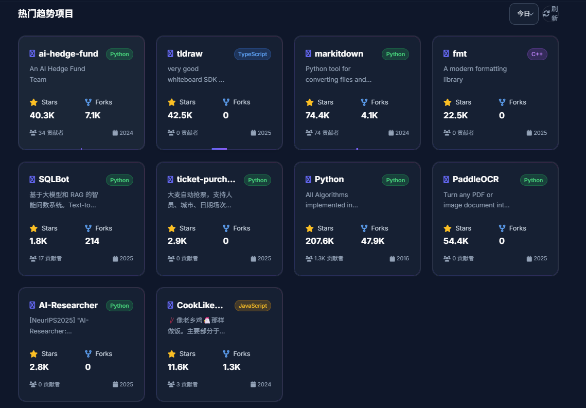
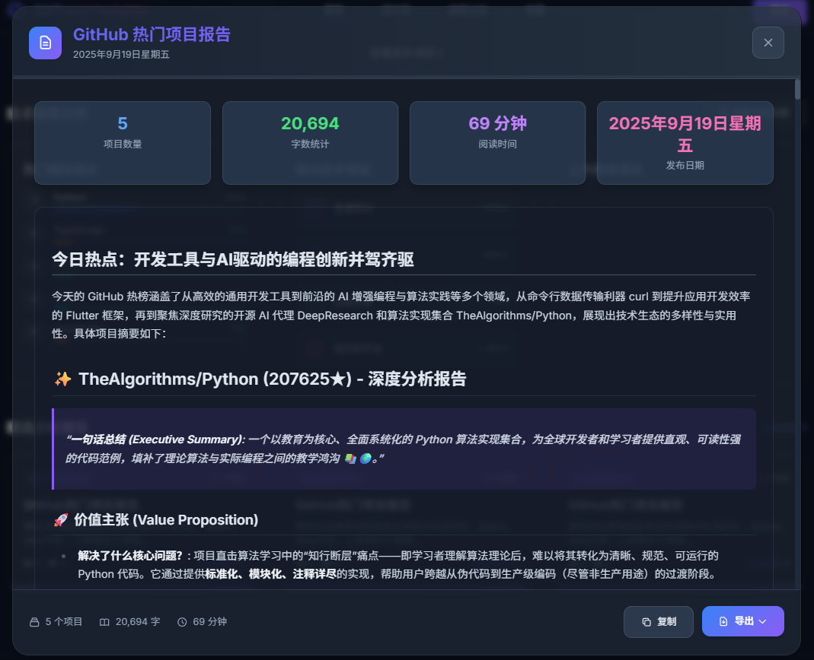
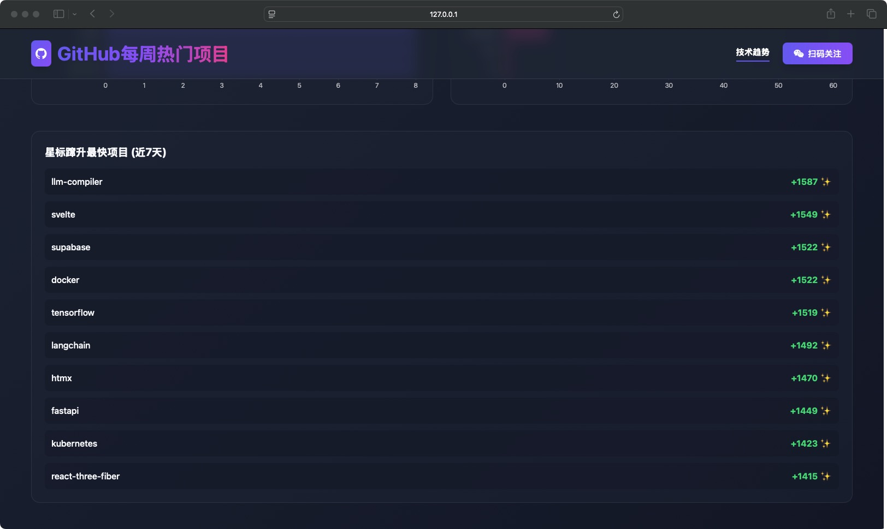

# GitHub Trending Reporter 🚀

[English](./README-EN.md) | 简体中文

**一个自动化分析 GitHub Trending 的机器人，为您每日精选、总结并生成技术洞察报告。**

[](https://opensource.org/licenses/MIT)
[](https://www.python.org/)
[](https://flask.palletsprojects.com/)
[](https://vuejs.org/)
[](https://www.docker.com/)

---

## 🌟 项目亮点

- **📈 每日追踪与分析**: 自动抓取 GitHub Trending 的最新热门项目，并利用大语言模型（LLM）进行深度分析，产出“一句话点评”、“技术亮点”和“潜在影响”等洞察。
- **🌐 交互式 Web 界面**: 基于 Vue.js 构建的现代化前端，提供美观的报告浏览、搜索和筛选功能，支持响应式设计。
- **🚀 多维度数据分析**: 内置趋势分析看板，可查看“上榜最频繁项目”、“热门语言分布”、“星标蹿升最快项目”和“技术领域分析”，助您全面洞察技术潮流。
- **⚙️ 灵活高度可配**: 从 LLM 模型、API 地址到抓取频率、报告数量，几乎所有核心参数均可通过环境变量轻松配置。
- **📦 开箱即用**: 提供 Docker 支持，一键启动，无需繁琐的环境配置；同时支持多种运行模式（完整服务、仅Web、仅报告生成器）。
- **💾 数据持久化**: 使用 SQLite 数据库存储历史数据，避免重复分析，并支持趋势分析功能。

## 📊 数据看板与报告示例

项目不仅生成每日的详细报告，还提供了多维度的数据分析看板。

| 功能 | 截图 |
| :--- | :--- |
| **Web 报告主页** |  |
| **项目交互式卡片** |  |
| **星标蹿升趋势分析** |  |
| **Markdown 产出示例** |  |
| **技术趋势深度分析** |  |


## 🛠️ 技术栈

- **后端**: Python 3.x, Flask
- **前端**: Vue.js, TypeScript
- **数据抓取**: `requests`, `BeautifulSoup4`
- **AI 集成**: `openai`
- **任务调度**: `schedule`
- **数据库**: `SQLite`
- **部署**: `Docker`

## 📁 项目结构

项目采用前后端分离的架构设计：

```
├── backend/           # 后端代码目录
│   ├── app/           # 核心功能模块
│   │   ├── analyzer.py      # 数据分析功能
│   │   ├── summarizer.py    # AI 总结生成
│   │   ├── scraper.py       # GitHub 数据抓取
│   │   ├── database.py      # 数据库操作
│   │   └── main.py          # 任务执行入口
│   ├── app.py         # 主程序入口
│   └── router.py      # API 路由定义
├── frontend/          # 前端代码目录
│   ├── src/           # Vue.js 源码
│   │   ├── components/      # 可复用组件
│   │   ├── views/           # 页面视图
│   │   └── api/             # API 调用封装
│   └── package.json   # 前端依赖配置
├── .env.example       # 环境变量示例文件
└── README.md          # 项目说明文档
```

## 🚀 快速开始

### 1. 环境准备

克隆仓库并进入项目目录：
```bash
git clone https://github.com/lgy1027/ai-trending.git
cd ai-trending
```

### 2. 配置环境变量

复制 `.env.example` 文件为 `.env`，并填入您的 LLM 服务凭证：
```bash
cp .env.example .env
```
编辑 `.env` 文件：
```env
# .env
LLM_API_KEY="sk-your_api_key_here"
LLM_BASE_URL="https://api.openai.com/v1" # 根据您的服务商修改
LLM_MODEL="gpt-4-turbo" # 可选，默认为 gpt-4-turbo
```

### 3. 运行项目

#### 方式一：使用 Docker (推荐)

确保您已安装 Docker，然后执行：
```bash
# 构建镜像
docker build -t trending-reporter .

# 运行容器
docker run --env-file .env -p 5001:5001 trending-reporter
```

#### 方式二：本地运行

安装后端依赖：
```bash
cd backend
pip install -r requirements.txt
```

启动后端服务（统一启动入口）：
```bash
# 运行完整服务（Web API + 定时任务）- 推荐
cd backend
python app.py

# 仅运行Web API服务（用于前端开发）
python app.py --mode web --debug

# 仅运行定时报告生成器
python app.py --mode reporter

# 自定义端口和地址
python app.py --host 0.0.0.0 --port 8080 --debug
```

安装并启动前端服务（如需前端界面）：
```bash
cd frontend
npm install
npm run dev
```

访问地址：
- **后端API**: `http://127.0.0.1:5001`
- **前端界面**: `http://127.0.0.1:5173`

## ⚙️ 详细配置

### 环境变量 (`.env`)

- `LLM_API_KEY`: **(必需)** 大语言模型服务的 API Key。
- `LLM_BASE_URL`: **(必需)** 大语言模型服务的基础 URL。
- `LLM_MODEL`: (可选) 指定使用的模型，默认为 `gpt-4-turbo`。
- `GITHUB_API_TOKEN`: (可选) 您的 GitHub API Token。配置后可获取更详细的项目信息，并避免因 API 请求频率限制导致的问题。
- `SCHEDULE_TIME`: (可选) 每日任务执行的时间 (HH:MM 格式)，默认为 `"09:00"`。
- `NUM_PROJECTS_TO_SUMMARIZE`: (可选) 每日需要分析的新项目数量，默认为 `8`。
- `MAX_PROJECTS_TO_SCRAPE`: (可选) 从 Trending 列表中筛选的项目总数，默认为 `25`。
- `TRENDING_DATE_RANGE`: (可选) 指定抓取的时间范围，可选值为 `daily`, `weekly`, `monthly`，默认为 `daily`。

### 运行模式参数

项目支持三种运行模式，通过 `--mode` 参数指定：

- `full`: 运行完整服务（Web API + 定时任务）[默认]
- `web`: 仅运行 Web API 服务（适用于前端开发）
- `reporter`: 仅运行定时报告生成器（适用于后台运行）

其他常用参数：
- `--host`: Web 服务监听地址，默认为 `127.0.0.1`
- `--port`: Web 服务端口，默认为 `5001`
- `--debug`: 启用调试模式，适用于开发环境

## 公众号

欢迎关注我的公众号，获取实时技术解析及前沿观察。


## 🤝 贡献

欢迎任何形式的贡献！如果您有好的想法或发现了 Bug，请随时提出 Issue 或提交 Pull Request。

## � 许可证

本项目采用 [MIT 许可证](LICENSE)。
