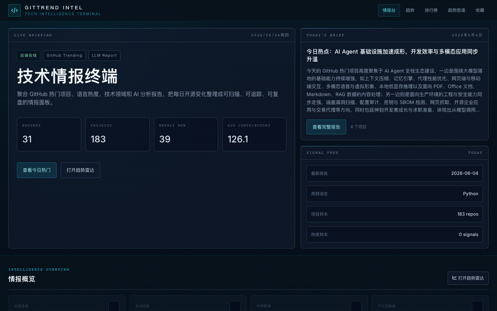
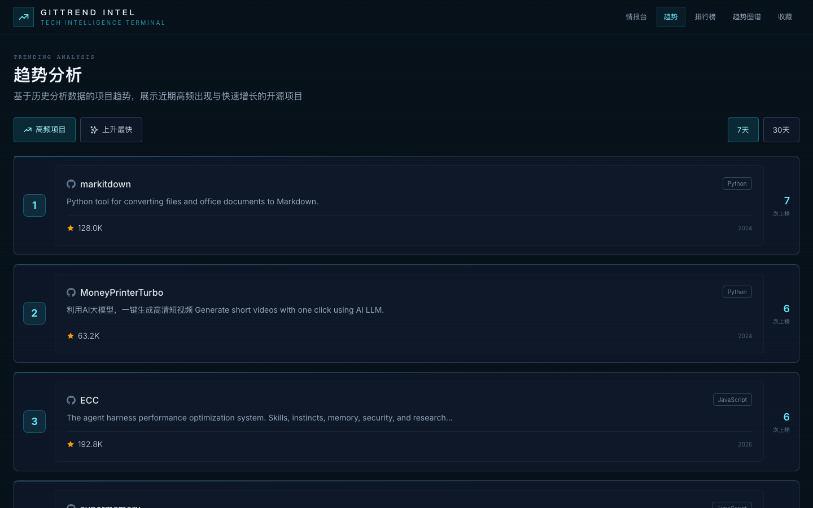
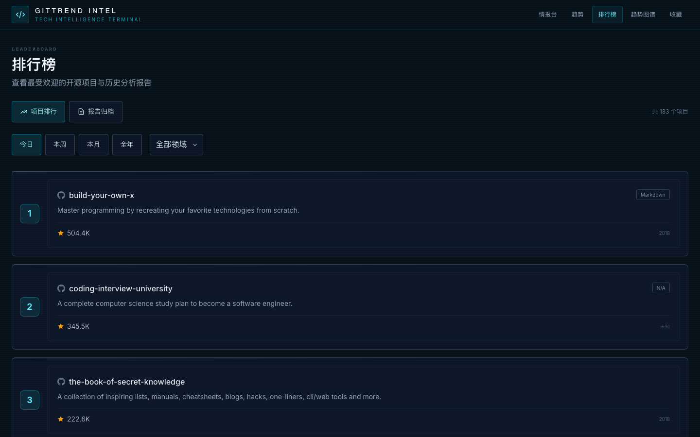
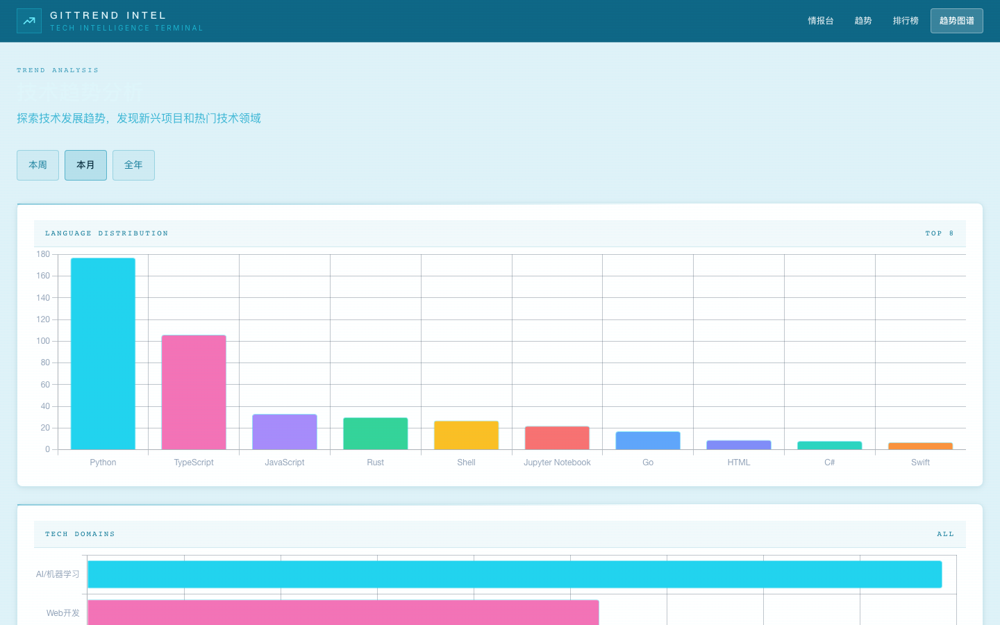

# GitHub Trending Reporter 🚀

[English](./README-EN.md) | 简体中文

**自动追踪 GitHub Trending，每日用 LLM 深度分析热门开源项目，生成中文洞察报告，并通过交互式 Web 仪表盘呈现技术趋势。**

[](https://opensource.org/licenses/MIT)
[](https://www.python.org/)
[](https://flask.palletsprojects.com/)
[](https://vuejs.org/)
[](https://www.docker.com/)

---

## ✨ 功能特性

- **📈 每日自动分析**：抓取 GitHub Trending，通过 LLM 生成"一句话点评 + 技术亮点 + 潜在影响"的中文洞察报告
- **🤖 零服务器运行**：GitHub Actions 每天 08:00（北京时间）自动执行，报告提交回仓库，部署到 GitHub Pages
- **🖥️ 情报终端界面**：浅青色海洋风格仪表盘，展示实时统计数据、最新报告摘要与项目侧边栏
- **📅 分析报告日历**：日历视图浏览历史日报，点击即可在统一风格弹窗中阅读报告内容
- **📊 多维趋势分析**：高频上榜项目、星标增速排名、语言分布图谱、技术领域分类
- **🏆 项目排行榜**：按 Star 数排列全量收录项目，支持按时间段和技术领域筛选
- **📁 报告归档**：所有历史日报一览，支持 Markdown / HTML 双格式下载
- **🔧 高度可配**：LLM 模型、API 地址、抓取数量、推送渠道等均通过环境变量控制

## 📸 界面截图

| 页面 | 截图 |
|------|------|
| **情报台** — 今日概览 + 分析报告日历 + 热门项目 |  |
| **趋势** — 高频上榜项目 / 星标增速排名 |  |
| **排行榜** — 全量项目 Star 排名 |  |
| **趋势图谱** — 语言分布 + 技术领域 + 新兴项目 |  |

## 🛠️ 技术栈

| 层级 | 技术 |
|------|------|
| 后端 | Python 3.12, Flask, SQLite, httpx |
| 前端 | Vue 3, TypeScript, Vite, Tailwind CSS 3, Chart.js |
| 自动化 | GitHub Actions, `schedule` 库 |
| 部署 | Docker, GitHub Pages |

## 🏗️ 架构设计

### 后端架构

```
GitHub Trending HTML
        │
        ▼
   scraper.py          ← BeautifulSoup 抓取热门仓库列表
        │
        ├──► database.py     ← 写入 fact_trending_snapshots（星型Schema）
        │
        └──► 过滤已分析项目
                │
                ▼
         summarizer.py       ← httpx 直连 LLM API（非 OpenAI SDK）
                │             构建中文 Prompt → 解析 Markdown 输出
                ▼
          database.py        ← 写入 summarized_projects（扁平化快速查询表）
                │
                ▼
         file_writer.py      ← 生成 output/md/ 和 output/html/ 报告文件
                │
                ▼
          notifier.py        ← 推送 DingTalk / Feishu / ClawBot
```

**API 层**（Flask）：

| 模块 | 说明 |
|------|------|
| `router.py` | 内联路由：`/api/reports`、`/api/trending`、`/api/trends`、`/api/stats` 等 |
| `routes/projects.py` | Blueprint：项目分页 / 搜索 / 过滤 |
| `routes/stats.py` | Blueprint：统计数据（内存缓存 5 min） |

**数据库**（SQLite，路径 `output/reporter.db`）：

- 星型 Schema：`dim_projects`、`dim_languages`、`dim_dates`、`fact_trending_snapshots`
- 扁平表：`summarized_projects`（含 `tech_domain`、`analysis`，供前端快速查询）

### 前端架构

```
frontend/src/
├── views/
│   ├── Home.vue          ← 情报台：概览 + 分析报告日历 + 热门项目
│   ├── Trend.vue         ← 趋势：高频项目 / 上升最快（7天/30天）
│   ├── Rankings.vue      ← 排行榜：项目 Star 排名
│   ├── TrendAnalysis.vue ← 趋势图谱：语言分布 + 技术领域 + 新兴项目 (Chart.js)
│   ├── Reports.vue       ← 日报列表
│   └── About.vue         ← 关于页面
├── components/
│   ├── ProjectCard.vue   ← 项目卡片
│   ├── ProjectModal.vue  ← 项目详情弹窗（浅青主题）
│   ├── ReportModal.vue   ← 报告阅读弹窗（markdown-it + 浅青主题）
│   └── StatsChart.vue    ← 统计图表
└── api/reports.ts        ← 统一 API 层（双模式：Live API / 静态 JSON）
```

**双数据模式**（由 `VITE_STATIC_MODE` 控制）：

- `false`（本地开发）：请求 Flask 后端 `localhost:5001`
- `true`（GitHub Pages）：读取 `docs/data/*.json` 静态文件，后端不可达时自动降级

## 🚀 快速开始

### 方式一：GitHub Actions 自动化（推荐，无需服务器）

**1. Fork / 克隆仓库**

**2. 配置 Secrets**（`Settings → Secrets and variables → Actions`）

| Secret | 是否必填 | 说明 |
|--------|----------|------|
| `LLM_API_KEY` | ✅ 必填 | LLM API 密钥 |
| `LLM_BASE_URL` | ✅ 必填 | LLM API 地址（需兼容 OpenAI 格式） |
| `LLM_MODEL` | 可选 | 模型名，默认 `gpt-4-turbo` |
| `GH_TOKEN` | 可选 | GitHub Token，提高 API 速率上限 |
| `DINGTALK_WEBHOOK` | 可选 | 钉钉推送 Webhook |
| `FEISHU_WEBHOOK` | 可选 | 飞书推送 Webhook |
| `CLAWBOT_WEBHOOK` | 可选 | ClawBot 推送 Webhook |

**3. 配置 Variables**（可选）

| Variable | 默认值 | 说明 |
|----------|--------|------|
| `NUM_PROJECTS_TO_SUMMARIZE` | `8` | 每日分析新项目数量 |
| `MAX_PROJECTS_TO_SCRAPE` | `25` | Trending 抓取总数 |
| `PAGES_URL` | — | GitHub Pages 地址，用于通知中附带链接 |

**4. 手动触发首次运行**

`Actions → Generate GitHub Trending Report → Run workflow`

**5. 开启 GitHub Pages**

`Settings → Pages → Source: Deploy from a branch → Branch: main / docs`

---

### 方式二：Docker 部署（含 Web 仪表盘）

```bash
docker build -t git-trending:latest .
docker run -d \
  --name git-trending \
  -p 5001:5001 \
  -v $(pwd)/output:/app/output \
  -e LLM_API_KEY="sk-xxx" \
  -e LLM_BASE_URL="https://api.openai.com/v1" \
  git-trending:latest
```

访问 `http://localhost:5001`

---

### 方式三：本地开发

```bash
# 后端
cd backend
pip install -r requirements.txt
# 通过环境变量传入 LLM_API_KEY 和 LLM_BASE_URL
LLM_API_KEY=sk-xxx LLM_BASE_URL=https://api.openai.com python app.py --mode web --debug

# 前端（新开终端）
cd frontend
npm install
npm run dev            # http://localhost:5173，自动代理 /api → :5001
```

## ⚙️ 完整环境变量

| 变量 | 默认值 | 说明 |
|------|--------|------|
| `LLM_API_KEY` | — | **必填** |
| `LLM_BASE_URL` | — | **必填** |
| `LLM_MODEL` | `gpt-4-turbo` | LLM 模型 |
| `LLM_MAX_RETRIES` | `3` | 调用失败重试次数 |
| `LLM_RETRY_DELAY` | `5` | 重试间隔（秒） |
| `LLM_TIMEOUT` | `60` | 请求超时（秒） |
| `GH_TOKEN` | — | GitHub API Token |
| `SCHEDULE_TIME` | `08:00` | 本地服务器每日执行时间 |
| `NUM_PROJECTS_TO_SUMMARIZE` | `8` | 每日分析新项目数 |
| `MAX_PROJECTS_TO_SCRAPE` | `25` | 每次抓取 Trending 项目总数 |
| `DAYS_TO_SKIP` | `7` | 跳过 N 天内已分析过的项目 |
| `TRENDING_DATE_RANGE` | `daily` | `daily` / `weekly` / `monthly` |
| `DINGTALK_WEBHOOK` | — | 钉钉推送 |
| `FEISHU_WEBHOOK` | — | 飞书推送 |
| `CLAWBOT_WEBHOOK` | — | ClawBot 推送 |
| `PAGES_URL` | — | GitHub Pages 地址（通知用） |

## 📁 输出目录

```
output/
├── reporter.db          # SQLite 数据库（历史数据）
├── md/                  # Markdown 格式日报
└── html/                # HTML 格式日报
```

## 🤝 贡献

欢迎提 Issue 或 Pull Request。

> **约定**：新增或修改功能时，请同步更新本 README 的相关章节（功能特性、架构设计、环境变量等），保持文档与代码一致。

## 📄 许可证

本项目采用 [MIT 许可证](LICENSE)。
